# 🪝 Documentación de Hooks del Map Widget

## 📋 Índice de Hooks

1. [useMapData](#usemapdata)
2. [useGeolocation](#usegeolocation) 
3. [useSearchFilter](#usesearchfilter)
4. [useRouteNavigation](#useroutenavigation)
5. [useFavorites](#usefavorites)

---

## 📊 useMapData

**Archivo:** `src/common/hooks/map/useMapData.ts`

Hook principal que procesa y organiza todos los datos necesarios para el mapa.

### 🎯 Propósito
Transformar datos crudos de la API en estructuras optimizadas para el renderizado del mapa, incluyendo cálculos de distancia, ordenamiento y formateo.

### 📥 Parámetros

```typescript
export const useMapData = (
  branchesData: Branch[] | undefined,     // Datos de sucursales de la API
  filteredBranchesData: Branch[] | undefined, // Sucursales filtradas por tienda
  userLocation: LatLngTuple | null,       // Ubicación GPS del usuario
  activeCafe: number | null,              // ID de cafetería actualmente seleccionada
  storesData: Store[] | undefined         // Datos de tiendas/cadenas
)
```

### 📤 Retorno

```typescript
interface UseMapDataReturn {
  defaultCenter: LatLngTuple;     // Centro por defecto del mapa
  cafes: Cafe[];                  // Lista completa de cafeterías procesadas
  cafePositions: MarkerPosition[]; // Posiciones para marcadores
  filteredCafes: Cafe[];          // Cafeterías después de filtros de tienda
  sortedCafes: Cafe[];           // Cafeterías ordenadas por distancia
  activeCafeData: Cafe | null;   // Datos de la cafetería activa
  availableStores: Store[];      // Tiendas disponibles para filtro
}
```

### 🔄 Procesamiento Interno

1. **Transformación de Datos:**
   ```typescript
   const transformBranchToCafe = (branch: Branch): Cafe => ({
     id: branch.id,
     name: branch.name,
     rating: branch.averageRating || 0,
     reviewCount: branch.reviewCount || 0,
     latitude: parseFloat(branch.latitude),
     longitude: parseFloat(branch.longitude),
     // ... más campos
   });
   ```

2. **Cálculo de Distancias:**
   ```typescript
   if (userLocation) {
     const distance = calculateDistance(
       userLocation[0], userLocation[1],
       cafe.latitude, cafe.longitude
     );
     cafe.distance = `${distance.toFixed(1)} km`;
     cafe.distanceValue = distance;
   }
   ```

3. **Ordenamiento por Proximidad:**
   ```typescript
   const sortedCafes = useMemo(() => {
     return filteredCafes.sort((a, b) => {
       if (userLocation && a.distanceValue && b.distanceValue) {
         return a.distanceValue - b.distanceValue;
       }
       return a.name.localeCompare(b.name);
     });
   }, [filteredCafes, userLocation]);
   ```

### ⚡ Optimizaciones
- Memoización de cálculos costosos
- Cache de transformaciones de datos
- Ordenamiento eficiente por distancia

---

## 🌍 useGeolocation

**Archivo:** `src/common/hooks/map/useGeolocation.ts`

Hook para gestionar la geolocalización del usuario con fallbacks y manejo de errores.

### 🎯 Propósito
Obtener y mantener actualizada la ubicación del usuario, manejando permisos, precisión y errores de GPS.

### 📥 Parámetros

```typescript
export const useGeolocation = (mapInstance: L.Map | null)
```

### 📤 Retorno

```typescript
interface UseGeolocationReturn {
  userLocation: LatLngTuple | null;  // Coordenadas [lat, lng] del usuario
  locatingUser: boolean;             // Estado de carga de ubicación
  accuracy: number | null;           // Precisión en metros
  errorMessage: string | null;       // Mensaje de error si falla
  getUserLocation: () => void;       // Función para re-obtener ubicación
}
```

### 🔧 Configuración GPS

```typescript
const geoOptions: PositionOptions = {
  enableHighAccuracy: true,    // Usar GPS de alta precisión
  timeout: 10000,             // Timeout de 10 segundos
  maximumAge: 300000          // Cache por 5 minutos
};
```

### 🛡️ Manejo de Errores

```typescript
const handleLocationError = (error: GeolocationPositionError) => {
  switch (error.code) {
    case error.PERMISSION_DENIED:
      setErrorMessage("Permisos de ubicación denegados");
      break;
    case error.POSITION_UNAVAILABLE:
      setErrorMessage("Ubicación no disponible");
      break;
    case error.TIMEOUT:
      setErrorMessage("Tiempo de espera agotado");
      break;
  }
};
```

### 🎯 Fallback por IP

```typescript
const getLocationByIP = async () => {
  try {
    const response = await fetch('https://ipapi.co/json/');
    const data = await response.json();
    return [data.latitude, data.longitude] as LatLngTuple;
  } catch {
    return LIMA_CENTER; // Fallback final
  }
};
```

---

## 🔍 useSearchFilter

**Archivo:** `src/common/hooks/map/useSearchFilter.ts`

Hook completo para búsqueda de texto y filtrado avanzado de cafeterías.

### 🎯 Propósito
Proporcionar funcionalidad de búsqueda en tiempo real y filtros múltiples para encontrar cafeterías específicas.

### 📥 Parámetros

```typescript
export const useSearchFilter = (cafes: Cafe[])
```

### 📤 Retorno

```typescript
interface UseSearchFilterReturn {
  searchTerm: string;                    // Término de búsqueda actual
  setSearchTerm: (term: string) => void; // Actualizar búsqueda
  filterOptions: FilterOptions;          // Opciones de filtro activas
  updateFilterOptions: (options: Partial<FilterOptions>) => void;
  resetFilters: () => void;              // Limpiar todos los filtros
  sortedCafes: Cafe[];                  // Cafeterías filtradas y ordenadas
  isFilterModalOpen: boolean;           // Estado del modal de filtros
  toggleFilterModal: () => void;        // Toggle del modal
}
```

### 🎛️ Opciones de Filtro

```typescript
export interface FilterOptions {
  minRating: number;          // Calificación mínima (0-5)
  maxDistance: number;        // Distancia máxima en km
  selectedTags: string[];     // Tags seleccionados (WiFi, Parking, etc.)
  onlyOpen: boolean;         // Solo mostrar cafeterías abiertas
  selectedStore: number;     // Filtrar por cadena específica
  sortBy: 'distance' | 'rating' | 'name'; // Criterio de ordenamiento
}
```

### 🔍 Algoritmo de Búsqueda

```typescript
const searchFilter = useMemo(() => {
  if (!searchTerm.trim()) return cafes;

  const normalizedSearch = normalizeText(searchTerm);
  
  return cafes.filter(cafe => {
    const nameMatch = normalizeText(cafe.name).includes(normalizedSearch);
    const addressMatch = normalizeText(cafe.address || '').includes(normalizedSearch);
    const tagMatch = cafe.tags.some(tag => 
      normalizeText(tag).includes(normalizedSearch)
    );
    
    return nameMatch || addressMatch || tagMatch;
  });
}, [cafes, searchTerm]);
```

### 🎯 Filtros Avanzados

```typescript
const filteredCafes = useMemo(() => {
  return searchFilter.filter(cafe => {
    // Filtro por calificación
    if (filterOptions.minRating > 0 && cafe.rating < filterOptions.minRating) {
      return false;
    }
    
    // Filtro por distancia
    if (filterOptions.maxDistance < 100 && cafe.distanceValue) {
      if (cafe.distanceValue > filterOptions.maxDistance) {
        return false;
      }
    }
    
    // Filtro por estado (abierto/cerrado)
    if (filterOptions.onlyOpen && !cafe.isOpen) {
      return false;
    }
    
    // Filtro por tags
    if (filterOptions.selectedTags.length > 0) {
      const hasSelectedTag = filterOptions.selectedTags.some(selectedTag =>
        cafe.tags.includes(selectedTag)
      );
      if (!hasSelectedTag) return false;
    }
    
    return true;
  });
}, [searchFilter, filterOptions]);
```

---

## 🧭 useRouteNavigation

**Archivo:** `src/common/hooks/map/useRouteNavigation.ts`

Hook para gestionar navegación, rutas y cálculo de direcciones entre ubicaciones.

### 🎯 Propósito
Proporcionar funcionalidad completa de navegación incluyendo múltiples modos de transporte y cálculo de rutas optimizadas.

### 📤 Retorno

```typescript
interface UseRouteNavigationReturn {
  transportMode: TransportMode;           // Modo de transporte actual
  setTransportMode: (mode: TransportMode) => void;
  origin: LatLngTuple | null;            // Punto de origen
  destination: LatLngTuple | null;       // Punto de destino
  setOrigin: (coords: LatLngTuple) => void;
  setDestination: (coords: LatLngTuple) => void;
  isCalculatingRoute: boolean;           // Estado de cálculo
  setIsCalculatingRoute: (calculating: boolean) => void;
  routeInfo: RouteInfo | null;          // Información de la ruta
  setRouteInfo: (info: RouteInfo) => void;
  routeCoordinates: LatLngTuple[];      // Coordenadas de la ruta
  clearRoute: () => void;               // Limpiar ruta actual
  isRouteActive: boolean;               // Ruta activa
}
```

### 🚗 Modos de Transporte

```typescript
export type TransportMode = 'driving' | 'walking' | 'cycling';

const TRANSPORT_CONFIG = {
  driving: {
    icon: '🚗',
    label: 'Conduciendo',
    profile: 'driving-car'
  },
  walking: {
    icon: '🚶',
    label: 'Caminando', 
    profile: 'foot-walking'
  },
  cycling: {
    icon: '🚴',
    label: 'Bicicleta',
    profile: 'cycling-regular'
  }
};
```

### 🗺️ Cálculo de Rutas

```typescript
const calculateRoute = async (
  origin: LatLngTuple,
  destination: LatLngTuple,
  mode: TransportMode
): Promise<RouteInfo> => {
  const profile = TRANSPORT_CONFIG[mode].profile;
  
  const response = await fetch(
    `https://api.openrouteservice.org/v2/directions/${profile}?` +
    `api_key=${API_KEY}&` +
    `start=${origin[1]},${origin[0]}&` +
    `end=${destination[1]},${destination[0]}`
  );
  
  const data = await response.json();
  
  return {
    distance: data.features[0].properties.segments[0].distance,
    time: data.features[0].properties.segments[0].duration,
    coordinates: decodePolyline(data.features[0].geometry.coordinates)
  };
};
```

### 📍 Información de Ruta

```typescript
interface RouteInfo {
  distance: number;        // Distancia en metros
  time: number;           // Tiempo en segundos
  coordinates: LatLngTuple[]; // Puntos de la ruta
  instructions?: string[];    // Instrucciones paso a paso
}
```

---

## ⭐ useFavorites

**Archivo:** `src/common/hooks/map/useFavorites.ts`

Hook para gestionar cafeterías favoritas del usuario con persistencia local.

### 🎯 Propósito
Permitir a los usuarios marcar cafeterías como favoritas y mantener esta información entre sesiones.

### 📤 Retorno

```typescript
interface UseFavoritesReturn {
  favorites: number[];                    // IDs de cafeterías favoritas
  toggleFavorite: (cafeId: number) => void; // Agregar/quitar favorito
  isFavorite: (cafeId: number) => boolean;  // Verificar si es favorito
  clearFavorites: () => void;             // Limpiar todos los favoritos
  favoritesCount: number;                 // Cantidad de favoritos
}
```

### 💾 Persistencia Local

```typescript
const FAVORITES_KEY = 'encafeinados_favorites';

// Cargar favoritos del localStorage
const loadFavorites = (): number[] => {
  try {
    const stored = localStorage.getItem(FAVORITES_KEY);
    return stored ? JSON.parse(stored) : [];
  } catch {
    return [];
  }
};

// Guardar favoritos en localStorage
const saveFavorites = (favorites: number[]) => {
  try {
    localStorage.setItem(FAVORITES_KEY, JSON.stringify(favorites));
  } catch (error) {
    console.warn('No se pudieron guardar los favoritos:', error);
  }
};
```

### 🔄 Gestión de Estado

```typescript
const [favorites, setFavorites] = useState<number[]>(loadFavorites);

const toggleFavorite = useCallback((cafeId: number) => {
  setFavorites(prev => {
    const newFavorites = prev.includes(cafeId)
      ? prev.filter(id => id !== cafeId)  // Remover
      : [...prev, cafeId];                // Agregar
    
    saveFavorites(newFavorites);
    
    // Mostrar feedback al usuario
    toast.success(
      newFavorites.includes(cafeId) 
        ? '¡Agregado a favoritos!' 
        : 'Removido de favoritos',
      { icon: '⭐' }
    );
    
    return newFavorites;
  });
}, []);
```

### 📊 Utilidades

```typescript
const isFavorite = useCallback((cafeId: number): boolean => {
  return favorites.includes(cafeId);
}, [favorites]);

const favoritesCount = favorites.length;

const clearFavorites = useCallback(() => {
  setFavorites([]);
  saveFavorites([]);
  toast.success('Favoritos limpiados');
}, []);
```

---

## 🔗 Integración Entre Hooks

### 🔄 Flujo de Datos Típico

```mermaid
graph TD
    A[useMapData] --> B[Procesa datos de API]
    B --> C[useSearchFilter]
    C --> D[Filtra y busca cafeterías]
    D --> E[useGeolocation]
    E --> F[Calcula distancias]
    F --> G[useFavorites]
    G --> H[Marca favoritos]
    H --> I[useRouteNavigation]
    I --> J[Calcula rutas]
    J --> K[Renderiza mapa actualizado]
```



### 🎯 Ejemplo de Integración

```typescript
// En MapView.widget.tsx
const MapView: React.FC = () => {
  // Hooks de datos
  const { data: branchesData } = useBranches();
  const { data: storesData } = useApprovedStores();
  
  // Hooks de funcionalidad
  const { userLocation, getUserLocation } = useGeolocation(mapInstance);
  const { favorites, toggleFavorite } = useFavorites();
  
  // Hook principal que integra todo
  const {
    cafes,
    sortedCafes,
    activeCafeData
  } = useMapData(branchesData, filteredBranchesData, userLocation, activeCafe, storesData);
  
  // Hook de filtros que usa los datos procesados
  const {
    searchTerm,
    filterOptions,
    sortedCafes: filteredSortedCafes
  } = useSearchFilter(cafes);
  
  // Hook de navegación
  const {
    transportMode,
    routeInfo,
    startRoute
  } = useRouteNavigation();
  
  // Los hooks se integran automáticamente
  return (
    <MapContainer>
      <SmartClusterGroup 
        cafes={filteredSortedCafes}
        favorites={favorites}
        onToggleFavorite={toggleFavorite}
      />
    </MapContainer>
  );
};
```

---

## 📝 Buenas Prácticas

### ✅ **Usar Hooks Correctamente**

1. **Memoización apropiada:**
   ```typescript
   const expensiveCalculation = useMemo(() => {
     return cafes.map(cafe => calculateDistance(cafe, userLocation));
   }, [cafes, userLocation]);
   ```

2. **Callbacks optimizados:**
   ```typescript
   const handleCafeSelect = useCallback((cafeId: number) => {
     setActiveCafe(cafeId);
   }, []); // Sin dependencias si solo actualiza estado
   ```

3. **Efectos controlados:**
   ```typescript
   useEffect(() => {
     if (userLocation && cafes.length > 0) {
       // Lógica que depende de ambos valores
     }
   }, [userLocation, cafes.length]); // Dependencias específicas
   ```

### ⚠️ **Evitar Anti-patrones**

❌ **No hacer:**
```typescript
// Re-renderizar en cada cambio
const [data, setData] = useState();
useEffect(() => {
  // Se ejecuta en cada render
  setData(expensiveCalculation());
});
```

✅ **Hacer:**
```typescript
// Usar memoización
const data = useMemo(() => expensiveCalculation(), [dependencies]);
```

---

## 🧪 Testing de Hooks

### 🔬 **Setup de Tests**

```typescript
// __tests__/hooks/useMapData.test.ts
import { renderHook, act } from '@testing-library/react';
import { useMapData } from '../useMapData';

const mockBranchesData = [
  {
    id: 1,
    name: 'Café Central',
    latitude: '-12.0464',
    longitude: '-77.0428',
    // ... más datos
  }
];
```

### 🧪 **Test de useMapData**

```typescript
describe('useMapData', () => {
  it('should transform branches to cafes correctly', () => {
    const { result } = renderHook(() => 
      useMapData(
        mockBranchesData,
        null,
        [-12.0464, -77.0428], // Lima
        null,
        mockStoresData
      )
    );

    expect(result.current.cafes).toHaveLength(1);
    expect(result.current.cafes[0].name).toBe('Café Central');
    expect(result.current.cafes[0].distanceValue).toBeDefined();
  });

  it('should sort cafes by distance when user location is available', () => {
    const { result } = renderHook(() => 
      useMapData(mockMultipleBranches, null, userLocation, null, null)
    );

    const distances = result.current.sortedCafes.map(cafe => cafe.distanceValue);
    expect(distances).toEqual([...distances].sort((a, b) => a - b));
  });
});
```

### 🧪 **Test de useSearchFilter**

```typescript
describe('useSearchFilter', () => {
  it('should filter cafes by search term', () => {
    const { result } = renderHook(() => useSearchFilter(mockCafes));

    act(() => {
      result.current.setSearchTerm('Starbucks');
    });

    expect(result.current.sortedCafes).toHaveLength(1);
    expect(result.current.sortedCafes[0].name).toContain('Starbucks');
  });

  it('should apply rating filter correctly', () => {
    const { result } = renderHook(() => useSearchFilter(mockCafes));

    act(() => {
      result.current.updateFilterOptions({ minRating: 4 });
    });

    result.current.sortedCafes.forEach(cafe => {
      expect(cafe.rating).toBeGreaterThanOrEqual(4);
    });
  });
});
```

---

**📅 Última actualización:** Mayo 26, 2025  
**👨‍💻 Mantenido por:** Equipo de Desarrollo Encafeinados

> 💡 **Nota:** Los hooks están diseñados para ser reutilizables y modulares. Cada uno tiene una responsabilidad específica y bien definida.
