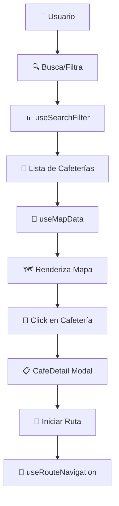

# 🗺️ Map Widget - Guía Completa para Desarrolladores

## 📋 Índice de Navegación Rápida

| Sección | Descripción | Link Rápido |
|---------|-------------|-------------|
| **🚀 Setup Inicial** | Configuración y primeros pasos | [Ver](#-setup-inicial) |
| **🏗️ Arquitectura** | Comprende la estructura del sistema | [Ver documentación completa](./MAP_WIDGET_DOCUMENTATION.md#-arquitectura-del-sistema) |
| **🪝 Hooks** | Guía detallada de todos los hooks | [Ver documentación completa](./MAP_HOOKS_DOCUMENTATION.md) |
| **💻 Desarrollo** | Flujo de trabajo y mejores prácticas | [Ver](#-flujo-de-desarrollo) |
| **🔧 Troubleshooting** | Solución de problemas comunes | [Ver](./MAP_WIDGET_DOCUMENTATION.md#-troubleshooting) |

---

## 🎯 Introducción

Bienvenido al **Map Widget** de Encafeinados. Este es el componente más complejo de la aplicación, responsable de:

- 📍 Mostrar cafeterías en un mapa interactivo
- 🔍 Búsqueda y filtrado en tiempo real
- 🧭 Navegación y cálculo de rutas
- ⭐ Gestión de favoritos
- 📱 Experiencia responsive completa

### 📊 Estadísticas del Componente
- **1,182 líneas** en el componente principal
- **5 hooks personalizados** especializados
- **15+ componentes** moleculares relacionados
- **10+ archivos** de tipos TypeScript

---

## 🚀 Setup Inicial

### 📋 Prerequisites

Antes de trabajar en el Map Widget, asegúrate de tener:

```bash
# Dependencias principales
✅ React 18+
✅ TypeScript 5+
✅ React Query (TanStack Query)
✅ React Router
✅ Framer Motion
✅ React Leaflet
✅ Leaflet
```

### 🔧 Instalación

```bash
# Si es tu primera vez, instala las dependencias específicas del mapa
npm install react-leaflet leaflet framer-motion
npm install -D @types/leaflet

# Asegúrate de que estos estilos estén importados
# En tu main.tsx o App.tsx:
import 'leaflet/dist/leaflet.css';
```

### 📁 Estructura de Archivos que Debes Conocer

```
📦 Map Widget Files
├── 🎯 PRINCIPALES
│   ├── src/common/widgets/map/map_view.widget.tsx          # ⭐ COMPONENTE PRINCIPAL
│   ├── src/common/widgets/map/map_search.widget.tsx        # 🔍 Widget de búsqueda
│   └── src/common/widgets/map/map_animations.widget.ts     # 🎬 Animaciones
│
├── 🧩 MOLÉCULAS (Componentes)
│   ├── src/common/molecules/map/cafe_card.molecule.tsx     # 🏪 Tarjeta de cafetería
│   ├── src/common/molecules/map/cafe_detail.molecule.tsx   # 📋 Modal de detalles
│   ├── src/common/molecules/map/map_sidebar.molecule.tsx   # 📱 Sidebar
│   ├── src/common/molecules/map/filter_modal.molecule.tsx  # 🎛️ Modal de filtros
│   └── src/common/molecules/map/route_controls.molecule.tsx # 🧭 Controles de ruta
│
├── 🪝 HOOKS PERSONALIZADOS
│   ├── src/common/hooks/map/useMapData.ts                  # 📊 Gestión de datos
│   ├── src/common/hooks/map/useGeolocation.ts              # 🌍 Ubicación GPS
│   ├── src/common/hooks/map/useSearchFilter.ts             # 🔍 Búsqueda y filtros
│   ├── src/common/hooks/map/useRouteNavigation.ts          # 🧭 Navegación
│   └── src/common/hooks/map/useFavorites.ts                # ⭐ Favoritos
│
└── 📚 DOCUMENTACIÓN
    ├── docs/MAP_WIDGET_DOCUMENTATION.md                    # 📖 Documentación principal
    ├── docs/MAP_HOOKS_DOCUMENTATION.md                     # 🪝 Documentación de hooks
    └── docs/MAP_WIDGET_DEVELOPER_GUIDE.md                  # 👤 Esta guía
```

---

## 💻 Flujo de Desarrollo

### 🔍 Paso 1: Entender el Flujo de Datos



### 🧩 Paso 2: Conocer los Hooks Principales

| Hook | Responsabilidad | Cuándo Usarlo |
|------|----------------|---------------|
| `useMapData` | Procesa datos de API | Necesitas lista de cafeterías |
| `useSearchFilter` | Búsqueda y filtros | Implementas nuevos filtros |
| `useGeolocation` | Ubicación del usuario | Necesitas coordenadas GPS |
| `useRouteNavigation` | Rutas y navegación | Calculas distancias/rutas |
| `useFavorites` | Gestión de favoritos | Guardas preferencias |

> 💡 **Tip:** Lee primero la [documentación de hooks](./MAP_HOOKS_DOCUMENTATION.md) para entender cada uno en detalle.

### 🎨 Paso 3: Entender los Componentes Clave

#### 🎯 MapView (El Componente Principal)
- **Ubicación:** `map_view.widget.tsx`
- **Líneas:** 1,182
- **Responsabilidad:** Orquestar toda la funcionalidad

```typescript
// Estructura básica del componente
const MapView: React.FC<MapViewProps> = ({ view = true }) => {
  // 🪝 Hooks de datos
  const { cafes, sortedCafes } = useMapData(/* params */);
  const { userLocation } = useGeolocation(mapInstance);
  
  // 🎮 Estado local
  const [activeCafe, setActiveCafe] = useState<number | null>(null);
  const [mapInstance, setMapInstance] = useState<L.Map | null>(null);
  
  // 🎨 Renderizado
  return (
    <MapContainer>
      {/* Capas del mapa */}
      <TileLayer />
      <SmartClusterGroup cafes={sortedCafes} />
      
      {/* UI Components */}
      <MapSidebar />
      <FilterModal />
      {activeCafe && <CafeDetail />}
    </MapContainer>
  );
};
```

#### 🏪 CafeCard (Tarjetas de Cafetería)
- **Nueva funcionalidad 2024:** Horarios en tiempo real
- **Hook utilizado:** `useBranchSchedules(cafe.id)`

```typescript
// Ejemplo de cómo se usan los horarios
const { data: schedulesData } = useBranchSchedules(cafe.id);
const isCurrentlyOpen = schedulesData ? isBranchOpenNow(schedulesData) : cafe.isOpen;
```

---

## 🛠️ Casos de Uso Comunes

### 🔧 Caso 1: Añadir un Nuevo Filtro

**Objetivo:** Agregar filtro "Solo WiFi"

1. **Actualizar tipos:**
```typescript
// En useSearchFilter.ts
export interface FilterOptions {
  // ... filtros existentes
  onlyWifi: boolean; // ✨ Nuevo filtro
}
```

2. **Modificar lógica de filtrado:**
```typescript
// En useSearchFilter.ts
const applyFilters = (cafes: Cafe[]): Cafe[] => {
  return cafes.filter(cafe => {
    // ... filtros existentes
    if (filterOptions.onlyWifi && !cafe.hasWifi) return false;
    return true;
  });
};
```

3. **Añadir al UI:**
```typescript
// En filter_modal.molecule.tsx
<FilterToggle
  label="Solo WiFi"
  checked={filterOptions.onlyWifi}
  onChange={(checked) => updateFilterOptions({ onlyWifi: checked })}
/>
```

### 🎯 Caso 2: Modificar el Comportamiento de Búsqueda

**Objetivo:** Cambiar el tiempo de debounce de 800ms a 500ms

```typescript
// En map_view.widget.tsx, buscar:
useEffect(() => {
  const handler = setTimeout(() => {
    setDebouncedSearchValue(searchInputValue);
  }, 500); // ✨ Cambiar de 800 a 500
  
  return () => clearTimeout(handler);
}, [searchInputValue]);
```

### 🗺️ Caso 3: Añadir Nueva Funcionalidad al Mapa

**Objetivo:** Mostrar líneas de tráfico en tiempo real

1. **Crear componente:**
```typescript
// traffic_layer.molecule.tsx
import { useMap } from 'react-leaflet';

export const TrafficLayer: React.FC = () => {
  const map = useMap();
  
  useEffect(() => {
    // Lógica para añadir capa de tráfico
    const trafficLayer = L.tileLayer('URL_DE_TRAFICO');
    map.addLayer(trafficLayer);
    
    return () => map.removeLayer(trafficLayer);
  }, [map]);
  
  return null;
};
```

2. **Integrar en MapView:**
```typescript
// En map_view.widget.tsx
<MapContainer>
  <TileLayer />
  <TrafficLayer /> {/* ✨ Nuevo componente */}
  <SmartClusterGroup />
</MapContainer>
```

---

## 🧪 Testing y Debugging

### 🔍 Debug Mode

Activa el modo debug para logs detallados:

```typescript
// En tu archivo .env.local
VITE_DEBUG_MAP=true

// En el código, verás logs como:
console.log('Map data processing:', {
  branchesCount: branchesData?.length || 0,
  userLocation,
  activeCafe,
  processingTime: Date.now()
});
```

### 🧪 Testing de Hooks

```typescript
// __tests__/useMapData.test.ts
import { renderHook } from '@testing-library/react';
import { useMapData } from '../useMapData';

test('should calculate distances correctly', () => {
  const { result } = renderHook(() => useMapData(
    mockBranchesData,
    null,
    [-12.0464, -77.0428], // Lima
    null,
    null
  ));

  expect(result.current.sortedCafes[0].distanceValue).toBeLessThan(1000);
});
```

### 📱 Testing Responsive

```typescript
// Simular móvil en tests
Object.defineProperty(window, 'innerWidth', {
  writable: true,
  configurable: true,
  value: 375, // iPhone width
});

// Disparar evento de resize
window.dispatchEvent(new Event('resize'));
```

---

## 🚨 Problemas Comunes y Soluciones

### ❌ Problema: Mapa no se ve

**Síntomas:**
- Contenedor vacío donde debería estar el mapa
- Console error sobre Leaflet

**Solución:**
```typescript
// 1. Verificar que CSS esté importado
import 'leaflet/dist/leaflet.css';

// 2. Verificar z-index
.leaflet-container {
  z-index: 1 !important;
}

// 3. Forzar redimensionamiento
useEffect(() => {
  if (mapInstance) {
    setTimeout(() => mapInstance.invalidateSize(), 100);
  }
}, [containerSize]);
```

### ❌ Problema: Búsqueda no funciona

**Diagnóstico:**
```typescript
// Añadir estos logs temporalmente:
console.log('Search input:', searchInputValue);
console.log('Debounced value:', debouncedSearchValue);
console.log('Filter term:', filterSearchTerm);
console.log('Results:', sortedCafes.length);
```

### ❌ Problema: Geolocalización falla

**Solución:**
```typescript
// Verificar permisos
navigator.permissions.query({name: 'geolocation'}).then(result => {
  console.log('Geolocation permission:', result.state);
});

// Usar fallback
const FALLBACK_LOCATION: LatLngTuple = [-12.0464, -77.0428]; // Lima
```

---

## 📚 Recursos y Referencias

### 📖 Documentación Relacionada
- [📋 Documentación Principal del Map Widget](./MAP_WIDGET_DOCUMENTATION.md)
- [🪝 Documentación Detallada de Hooks](./MAP_HOOKS_DOCUMENTATION.md)
- [⏰ Implementación de Horarios](./HORARIOS_IMPLEMENTATION_SUMMARY.md)

### 🔗 APIs y Librerías
- [React Leaflet](https://react-leaflet.js.org/) - Componentes de mapa
- [Leaflet](https://leafletjs.com/) - Librería base del mapa
- [Framer Motion](https://www.framer.com/motion/) - Animaciones
- [React Query](https://tanstack.com/query) - Gestión de estado servidor

### 🛠️ Herramientas de Desarrollo
- **React DevTools** - Para inspeccionar hooks
- **Network Tab** - Para debug de APIs
- **Console** - Para logs de debugging

---

## ✅ Checklist para Nuevos Desarrolladores

### 📚 Preparación (1-2 días)
- [ ] Leer esta guía completa
- [ ] Revisar [documentación principal](./MAP_WIDGET_DOCUMENTATION.md)
- [ ] Estudiar [documentación de hooks](./MAP_HOOKS_DOCUMENTATION.md)
- [ ] Configurar entorno de desarrollo
- [ ] Ejecutar proyecto localmente

### 🔍 Exploración (1 día)
- [ ] Navegar por todas las funcionalidades del mapa
- [ ] Probar búsquedas y filtros
- [ ] Testear en móvil y desktop
- [ ] Experimentar con favoritos y rutas
- [ ] Revisar Network tab para entender APIs

### 🧪 Práctica (2-3 días)
- [ ] Hacer cambios menores (colores, textos)
- [ ] Añadir console.logs para entender flujo
- [ ] Modificar un filtro existente
- [ ] Crear un componente simple
- [ ] Escribir un test básico

### 🚀 Desarrollo (Ongoing)
- [ ] Implementar nueva funcionalidad asignada
- [ ] Escribir tests para tu código
- [ ] Actualizar documentación si es necesario
- [ ] Code review con el equipo

---

## 🆘 Cuando Necesites Ayuda

### 🔍 Orden de Diagnóstico
1. **Revisar console** para errores
2. **Buscar en esta documentación** el problema
3. **Revisar código** de componentes similares
4. **Añadir logs** para entender el flujo
5. **Preguntar al equipo** si persiste el problema

### 📧 Contactos
- **Lead Developer:** [Contacto del equipo]
- **Map Widget Owner:** [Especialista en el componente]
- **Documentation:** [Maintainer de docs]

---

## 🎓 Recursos de Aprendizaje

### 📹 Videos Recomendados
- "React Leaflet Basics" - Conceptos fundamentales
- "Advanced React Hooks" - Patrones avanzados
- "TypeScript Best Practices" - Mejores prácticas

### 📚 Artículos Útiles
- Documentación oficial de React Leaflet
- Guías de performance en React
- Patrones de hooks personalizados

---

**📅 Última actualización:** Mayo 26, 2025  
**👨‍💻 Mantenido por:** Equipo de Desarrollo Encafeinados  
**📧 Preguntas:** Contacta al equipo para dudas sobre esta guía

> 💡 **Recuerda:** Este es un componente complejo pero bien documentado. Tómate tiempo para entender antes de modificar, y no dudes en preguntar cuando tengas dudas.
