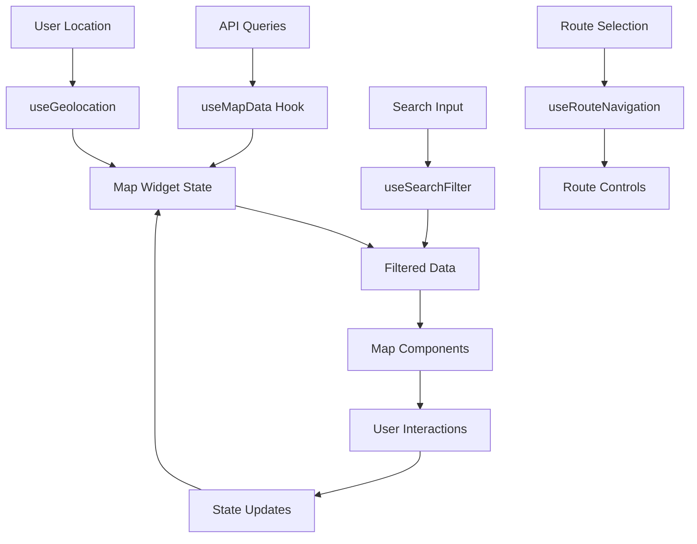

# 🗺️ Documentación del Map Widget - Encafeinados

## 📋 Tabla de Contenidos

1. [Visión General](#visión-general)
2. [Arquitectura del Sistema](#arquitectura-del-sistema)
3. [Componentes Principales](#componentes-principales)
4. [Hooks Personalizados](#hooks-personalizados)
5. [Flujos de Datos](#flujos-de-datos)
6. [Gestión de Estado](#gestión-de-estado)
7. [Eventos y Interacciones](#eventos-y-interacciones)
8. [Performance y Optimizaciones](#performance-y-optimizaciones)
9. [Guía de Desarrollo](#guía-de-desarrollo)
10. [Troubleshooting](#troubleshooting)

---

## 🎯 Visión General

El **Map Widget** es el componente central de la aplicación Encafeinados que permite a los usuarios:

- 📍 Visualizar cafeterías en un mapa interactivo
- 🔍 Buscar y filtrar establecimientos
- 🧭 Obtener direcciones y rutas
- ⭐ Gestionar favoritos
- 📱 Experiencia responsive móvil/desktop
- 🕒 Ver horarios y estado de apertura en tiempo real

### 🛠️ Stack Tecnológico

- **React 18** + TypeScript
- **React Leaflet** para el mapa
- **Framer Motion** para animaciones
- **React Query** para gestión de datos
- **Lucide Icons** para iconografía
- **Tailwind CSS** para estilos

---

## 🏗️ Arquitectura del Sistema

### 📂 Estructura de Archivos

```
src/common/widgets/map/
├── map_view.widget.tsx          # ✨ Componente principal
├── map_animations.widget.ts     # 🎬 Definiciones de animaciones
└── map_search.widget.tsx        # 🔍 Widget de búsqueda

src/common/molecules/map/
├── cafe_card.molecule.tsx       # 🏪 Tarjeta de cafetería
├── cafe_detail.molecule.tsx     # 📋 Modal de detalles
├── cafe_marker.molecule.tsx     # 📍 Marcador individual
├── map_sidebar.molecule.tsx     # 📱 Barra lateral
├── filter_modal.molecule.tsx    # 🎛️ Modal de filtros
├── route_controls.molecule.tsx  # 🧭 Controles de ruta
├── smart_cluster_group.molecule.tsx # 🗂️ Agrupación inteligente
└── user_marker.molecule.tsx     # 👤 Marcador de usuario

src/common/hooks/map/
├── useMapData.ts               # 📊 Gestión de datos del mapa
├── useGeolocation.ts           # 🌍 Geolocalización
├── useSearchFilter.ts          # 🔍 Búsqueda y filtros
├── useRouteNavigation.ts       # 🧭 Navegación y rutas
└── useFavorites.ts            # ⭐ Gestión de favoritos
```

### 🔄 Flujo de Datos



---

## 🧩 Componentes Principales

### 🎯 **MapView Widget**
**Archivo:** `map_view.widget.tsx` (1182 líneas)

El componente raíz que orquesta toda la funcionalidad del mapa.

#### 🔧 Props Interface
```typescript
export interface MapViewProps {
  view?: boolean; // Mostrar botón de volver
}
```

#### 🎛️ Estado Principal
```typescript
// Estados de UI
const [mapLoaded, setMapLoaded] = useState<boolean>(false);
const [showSidebar, setShowSidebar] = useState<boolean>(false);
const [activeCafe, setActiveCafe] = useState<number | null>(null);
const [viewMode, setViewMode] = useState<'map' | 'list'>('map');

// Estados de búsqueda
const [searchTerm, setSearchTermLocal] = useState<string>('');
const [isSearchProcessing, setIsSearchProcessing] = useState(false);

// Estados de navegación
const [showRouteControls, setShowRouteControls] = useState<boolean>(false);
const [activeCafeData, setActiveCafeData] = useState<Cafe | null>(null);
```

#### ⚙️ Hooks Utilizados
- `useMapData()` - Gestión de datos de cafeterías
- `useGeolocation()` - Ubicación del usuario
- `useSearchFilter()` - Búsqueda y filtros
- `useRouteNavigation()` - Navegación y rutas
- `useFavorites()` - Gestión de favoritos

---

### 🎮 **MapController**
**Componente interno para gestión de instancia de mapa**

```typescript
const MapController: React.FC<{
  setMapInstance: (map: L.Map) => void;
  setTotalTiles: (total: number) => void;
  setTilesLoaded: (loaded: number) => void;
  setLoadingProgress: (progress: number) => void;
  setMapLoaded: (loaded: boolean) => void;
}>
```

#### 🎯 Responsabilidades:
- Configurar instancia de Leaflet
- Manejar carga de tiles
- Gestionar eventos táctiles móviles
- Configurar z-index de controles

---

### 🏪 **CafeCard**
**Archivo:** `cafe_card.molecule.tsx`

Tarjeta individual de cafetería en el sidebar.

#### ✨ Funcionalidades Nuevas (2024)
- 🕒 **Horarios en tiempo real** usando `useBranchSchedules()`
- 🏷️ **Atributos visuales** con iconos (WiFi, Parking, etc.)
- 📍 **Estado dinámico** (abierto/cerrado)
- ⏰ **Próxima apertura** cuando está cerrado

```typescript
// Obtener horarios reales de la API
const { data: schedulesData } = useBranchSchedules(cafe.id);
const isCurrentlyOpen = schedulesData ? isBranchOpenNow(schedulesData) : cafe.isOpen;
```

---

### 📋 **CafeDetail**
**Archivo:** `cafe_detail.molecule.tsx`

Modal de detalles completos de una cafetería.

#### 🎯 Componentes Integrados:
- `WeeklySchedule` - Horarios semanales completos
- Información de contacto y social
- Imágenes y galería
- Botones de acción (favoritos, navegación)

---

### 📱 **MapSidebar**
**Archivo:** `map_sidebar.molecule.tsx`

Barra lateral responsive para mostrar lista de cafeterías.

#### 📐 Comportamiento Responsive:
- **Móvil:** Overlay completo
- **Desktop:** Panel lateral fijo
- **Tablet:** Adaptativo según orientación

---

## 🪝 Hooks Personalizados

### 📊 **useMapData**
**Archivo:** `useMapData.ts`

Hook principal para gestión de datos del mapa.

```typescript
export const useMapData = (
  branchesData: any,
  filteredBranchesData: any,
  userLocation: LatLngTuple | null,
  activeCafe: number | null,
  storesData: any
) => {
  // Retorna datos procesados y organizados
  return {
    defaultCenter,
    cafes,
    cafePositions,
    filteredCafes,
    sortedCafes,
    activeCafeData,
    availableStores
  };
}
```

#### 🎯 Responsabilidades:
- Transformar datos de API a formato de mapa
- Calcular distancias desde ubicación del usuario
- Organizar datos para componentes

---

### 🌍 **useGeolocation**
**Archivo:** `useGeolocation.ts`

Manejo de geolocalización del usuario.

```typescript
export const useGeolocation = (mapInstance: L.Map | null) => {
  return {
    userLocation,
    locatingUser,
    accuracy,
    errorMessage,
    getUserLocation
  };
}
```

#### 🔒 Manejo de Permisos:
- Solicitud de permisos GPS
- Fallback a ubicación por IP
- Manejo de errores de precisión

---

### 🔍 **useSearchFilter**
**Archivo:** `useSearchFilter.ts`

Sistema completo de búsqueda y filtrado.

```typescript
export interface FilterOptions {
  minRating: number;
  maxDistance: number;
  selectedTags: string[];
  onlyOpen: boolean;
  selectedStore: number;
  sortBy: 'distance' | 'rating' | 'name';
}
```

#### 🎛️ Tipos de Filtros:
- **Texto:** Búsqueda por nombre
- **Rating:** Calificación mínima
- **Distancia:** Radio desde usuario
- **Tags:** Características específicas
- **Estado:** Solo abiertos
- **Tienda:** Filtro por cadena

---

### 🧭 **useRouteNavigation**
**Archivo:** `useRouteNavigation.ts`

Gestión de rutas y navegación.

```typescript
export const useRouteNavigation = () => {
  return {
    transportMode,
    setTransportMode,
    origin,
    destination,
    routeInfo,
    routeCoordinates,
    isCalculatingRoute,
    clearRoute,
    isRouteActive
  };
}
```

#### 🚗 Modos de Transporte:
- **Driving:** Automóvil
- **Walking:** Caminando
- **Cycling:** Bicicleta

---

## 🔄 Flujos de Datos

### 🔍 **Flujo de Búsqueda**

1. **Input del Usuario**
   ```typescript
   handleSearchChange(value: string)
   ```

2. **Debounce (800ms)**
   ```typescript
   useEffect(() => {
     const handler = setTimeout(() => {
       setDebouncedSearchValue(searchInputValue);
     }, 800);
   }, [searchInputValue]);
   ```

3. **Procesamiento**
   ```typescript
   setIsSearchProcessing(true);
   setFilterSearchTerm(currentSearch);
   ```

4. **Actualización de Resultados**
   ```typescript
   // Auto-selección del resultado más cercano
   if (sortedCafes.length > 0) {
     const closestCafe = sortedCafes[0];
     setActiveCafe(closestCafe.id);
   }
   ```

### 📍 **Flujo de Selección de Cafetería**

1. **Click en Marcador/Card**
   ```typescript
   setActiveCafe(cafeId)
   ```

2. **Actualización de Estado**
   ```typescript
   useEffect(() => {
     if (activeCafe) {
       const selectedCafe = cafes.find(cafe => cafe.id === activeCafe);
       setActiveCafeData(selectedCafe);
     }
   }, [activeCafe, cafes]);
   ```

3. **Navegación de Mapa**
   ```typescript
   mapInstance.flyTo(
     [cafe.latitude, cafe.longitude],
     16,
     { duration: 1.5, animate: true }
   );
   ```

4. **Mostrar Detalles**
   ```typescript
   <CafeDetail
     cafe={activeCafeData}
     // ... props
   />
   ```

---

## 🎛️ Gestión de Estado

### 🏪 **Estado de Cafeterías**

```typescript
// Estado activo
activeCafe: number | null           // ID de cafetería seleccionada
activeCafeData: Cafe | null        // Datos completos de cafetería activa

// Datos filtrados
sortedCafes: Cafe[]                // Lista filtrada y ordenada
searchTerm: string                 // Término de búsqueda actual
filterOptions: FilterOptions       // Opciones de filtrado activas
```

### 🗺️ **Estado del Mapa**

```typescript
// Instancia y carga
mapInstance: L.Map | null          // Instancia de Leaflet
mapLoaded: boolean                 // Estado de carga completa
loadingProgress: number            // Progreso de carga (0-100)

// Navegación
userLocation: LatLngTuple | null   // Ubicación GPS del usuario
showRouteControls: boolean         // Mostrar controles de ruta
transportMode: TransportMode       // Modo de transporte seleccionado
```

### 📱 **Estado de UI**

```typescript
// Vistas
viewMode: 'map' | 'list'          // Modo de visualización
showSidebar: boolean              // Mostrar barra lateral móvil
searchFocused: boolean            // Input de búsqueda enfocado

// Modales
isFilterModalOpen: boolean        // Modal de filtros abierto
showRouteControls: boolean        // Controles de ruta activos
```

---

## 🎬 Eventos y Interacciones

### 🖱️ **Eventos de Mapa**

```typescript
// Click en mapa (desktop)
mapInstance.on('click', (e) => {
  if (window.innerWidth >= 768 && activeCafe) {
    setActiveCafe(null); // Cerrar detalles
  }
});

// Carga de tiles
map.on('tileloadstart', onTileLoadStart);
map.on('tileload', onTileLoad);
```

### 📱 **Eventos Táctiles**

```typescript
// Configuración de eventos táctiles para móvil
mapContainer.addEventListener('touchmove', () => {}, { passive: true });
```

### 🔍 **Eventos de Búsqueda**

```typescript
// Cambio en input de búsqueda
onChange={(e) => {
  setSearchInputValue(e.target.value);
  setIsTyping(true);
}}

// Focus/blur de búsqueda
onFocus={() => setSearchFocused(true)}
onBlur={() => setTimeout(() => setSearchFocused(false), 200)}
```

### 🏪 **Eventos de Cafetería**

```typescript
// Selección de cafetería
const navigateToCafe = useCallback((cafeId: number) => {
  const selectedCafe = cafes.find(cafe => cafe.id === cafeId);
  setActiveCafeData(selectedCafe);
  setActiveCafe(cafeId);
}, [cafes]);

// Toggle de favoritos
const { toggleFavorite } = useFavorites();

// Iniciar ruta
const startRoute = useCallback((cafeId: number) => {
  setRouteOrigin(userLocation);
  setRouteDestination([cafe.latitude, cafe.longitude]);
}, [userLocation]);
```

---

## ⚡ Performance y Optimizaciones

### 🎯 **React Query Caching**

```typescript
// Configuración de cache para branches
export const useBranches = () => {
  return useQuery<Branch[]>({
    queryKey: ['branches'],
    queryFn: fetchBranches,
    staleTime: 10 * 60 * 1000, // 10 minutos
    refetchOnWindowFocus: false
  });
};
```

### 🗂️ **Clustering de Marcadores**

```typescript
// SmartClusterGroup optimiza la visualización de múltiples marcadores
<SmartClusterGroup
  cafes={sortedCafes} 
  activeCafe={activeCafe} 
  setActiveCafe={setActiveCafe}
/>
```

### 🎨 **Memoización de Componentes**

```typescript
// Cálculos memoizados
const availableTags = useMemo(() => {
  const allTags = cafes.flatMap(cafe => cafe.tags);
  return [...new Set(allTags)];
}, [cafes]);

// Callbacks optimizados
const navigateToCafe = useCallback((cafeId: number) => {
  // lógica optimizada
}, [cafes, mapInstance, userLocation]);
```

### 📱 **Optimizaciones Móviles**

```typescript
// Detección de dispositivo móvil
const isMobile = /Android|webOS|iPhone|iPad|iPod|BlackBerry|IEMobile|Opera Mini/i.test(navigator.userAgent);

// Simulación de carga optimizada para móvil
if (isMobile) {
  let fakeTotalTiles = 12; // Menos tiles para móvil
  // ... lógica de progreso
}
```

---

## 🛠️ Guía de Desarrollo

### 🔧 **Configuración del Entorno**

1. **Instalar dependencias:**
   ```bash
   npm install react-leaflet leaflet framer-motion
   npm install -D @types/leaflet
   ```

2. **Configurar estilos CSS:**
   ```css
   @import 'leaflet/dist/leaflet.css';
   @import './styles/leaflet-markercluster.css';
   @import './styles/mapMarkers.css';
   ```

### 📝 **Añadir Nueva Funcionalidad**

#### 🎯 **Ejemplo: Nuevo Filtro**

1. **Actualizar tipos:**
   ```typescript
   // FilterOptions interface
   export interface FilterOptions {
     // ... filtros existentes
     newFilter: boolean; // ✨ Nuevo filtro
   }
   ```

2. **Modificar hook de búsqueda:**
   ```typescript
   // useSearchFilter.ts
   const updateFilterOptions = (newOptions: Partial<FilterOptions>) => {
     setFilterOptions(prev => ({
       ...prev,
       ...newOptions
     }));
   };
   ```

3. **Añadir al FilterModal:**
   ```typescript
   // filter_modal.molecule.tsx
   <FilterToggle
     label="Nuevo Filtro"
     checked={filterOptions.newFilter}
     onChange={(checked) => updateFilterOptions({ newFilter: checked })}
   />
   ```

#### 🧩 **Ejemplo: Nuevo Componente de Mapa**

1. **Crear componente:**
   ```typescript
   // new_map_feature.molecule.tsx
   interface NewMapFeatureProps {
     mapInstance: L.Map | null;
     cafes: Cafe[];
   }

   export const NewMapFeature: React.FC<NewMapFeatureProps> = ({
     mapInstance,
     cafes
   }) => {
     // Implementación
     return null; // Para componentes que no renderizan UI directa
   };
   ```

2. **Integrar en MapView:**
   ```typescript
   // map_view.widget.tsx
   <MapContainer>
     {/* Componentes existentes */}
     <NewMapFeature 
       mapInstance={mapInstance} 
       cafes={sortedCafes} 
     />
   </MapContainer>
   ```

### 🧪 **Testing**

#### 🔬 **Tests Unitarios**
```typescript
// __tests__/useMapData.test.ts
import { renderHook } from '@testing-library/react';
import { useMapData } from '../useMapData';

describe('useMapData', () => {
  it('should process branch data correctly', () => {
    const { result } = renderHook(() => useMapData(
      mockBranchesData,
      null,
      mockUserLocation,
      null,
      mockStoresData
    ));

    expect(result.current.cafes).toHaveLength(3);
    expect(result.current.defaultCenter).toEqual([latitude, longitude]);
  });
});
```

#### 🔍 **Tests de Integración**
```typescript
// __tests__/MapView.integration.test.tsx
import { render, screen, fireEvent } from '@testing-library/react';
import MapView from '../map_view.widget';

describe('MapView Integration', () => {
  it('should filter cafes when searching', async () => {
    render(<MapView />);
    
    const searchInput = screen.getByPlaceholderText('Buscar cafeterías...');
    fireEvent.change(searchInput, { target: { value: 'Starbucks' } });
    
    await waitFor(() => {
      expect(screen.getByText('Starbucks Central')).toBeInTheDocument();
    });
  });
});
```

---

## 🚨 Troubleshooting

### ❌ **Problemas Comunes**

#### 🗺️ **Mapa no se carga**

**Síntomas:**
- Pantalla blanca donde debería estar el mapa
- Console error: "Leaflet container not found"

**Soluciones:**
```typescript
// 1. Verificar que Leaflet CSS esté importado
import 'leaflet/dist/leaflet.css';

// 2. Verificar z-index en estilos
.leaflet-container {
  z-index: 1;
}

// 3. Llamar invalidateSize después de cambios de tamaño
useEffect(() => {
  if (mapInstance) {
    setTimeout(() => {
      mapInstance.invalidateSize();
    }, 100);
  }
}, [containerSize]);
```

#### 📍 **Marcadores no aparecen**

**Síntomas:**
- Mapa se carga pero sin marcadores
- Datos de cafeterías disponibles pero no visibles

**Soluciones:**
```typescript
// 1. Verificar estructura de datos
console.log('Cafes data:', cafes);
console.log('Cafe positions:', cafePositions);

// 2. Verificar que las coordenadas sean válidas
const isValidCoordinate = (lat: number, lng: number) => {
  return lat >= -90 && lat <= 90 && lng >= -180 && lng <= 180;
};

// 3. Verificar que SmartClusterGroup reciba datos
<SmartClusterGroup
  cafes={sortedCafes.length > 0 ? sortedCafes : []} 
  activeCafe={activeCafe} 
  setActiveCafe={setActiveCafe}
/>
```

#### 🔍 **Búsqueda no funciona**

**Síntomas:**
- Input de búsqueda no responde
- Filtros no se aplican
- No hay resultados para términos válidos

**Soluciones:**
```typescript
// 1. Verificar debounce
useEffect(() => {
  console.log('Search term changed:', debouncedSearchValue);
  // Verificar que el efecto se ejecute
}, [debouncedSearchValue]);

// 2. Verificar filtros activos
console.log('Filter options:', filterOptions);
console.log('Sorted cafes:', sortedCafes);

// 3. Verificar normalización de texto
const normalizeText = (text: string) => {
  return text.toLowerCase()
    .normalize("NFD")
    .replace(/[\u0300-\u036f]/g, ""); // Remover acentos
};
```

#### 🧭 **Geolocalización falla**

**Síntomas:**
- No se obtiene ubicación del usuario
- Error de permisos GPS
- Ubicación imprecisa

**Soluciones:**
```typescript
// 1. Verificar permisos
navigator.permissions.query({name: 'geolocation'}).then((result) => {
  console.log('Geolocation permission:', result.state);
});

// 2. Configurar opciones de geolocalización
const options = {
  enableHighAccuracy: true,
  timeout: 10000,
  maximumAge: 300000 // 5 minutos
};

// 3. Implementar fallback
const fallbackLocation: LatLngTuple = [-12.0464, -77.0428]; // Lima, Perú
if (!userLocation && hasAttemptedLocation) {
  setUserLocation(fallbackLocation);
}
```

### 🛠️ **Herramientas de Debug**

#### 📊 **React DevTools**
- Instalar extensión React DevTools
- Verificar estado de hooks en tiempo real
- Profiler para identificar renders innecesarios

#### 🗺️ **Leaflet Debug**
```typescript
// Habilitar modo debug de Leaflet
if (process.env.NODE_ENV === 'development') {
  window.L = L; // Exponer Leaflet globalmente
  console.log('Map instance:', mapInstance);
}
```

#### 📡 **Network Monitoring**
```typescript
// Interceptar llamadas de API
const originalFetch = window.fetch;
window.fetch = (...args) => {
  console.log('API Call:', args[0]);
  return originalFetch(...args);
};
```

### 📝 **Logs Útiles**

```typescript
// En useMapData
console.log('Map data processing:', {
  branchesCount: branchesData?.length || 0,
  userLocation,
  activeCafe,
  processingTime: Date.now()
});

// En useSearchFilter
console.log('Search filter update:', {
  searchTerm,
  filterOptions,
  resultCount: sortedCafes.length,
  totalCafes: cafes.length
});

// En MapView render
console.log('MapView render:', {
  mapLoaded,
  activeCafe,
  viewMode,
  sidebarVisible: showSidebar
});
```

---

## 📚 Recursos Adicionales

### 📖 **Documentación de Dependencias**
- [React Leaflet](https://react-leaflet.js.org/)
- [Leaflet Documentation](https://leafletjs.com/reference.html)
- [Framer Motion](https://www.framer.com/motion/)
- [React Query](https://tanstack.com/query/latest)

### 🎓 **Conceptos Importantes**
- **Clustering:** Agrupación de marcadores cercanos
- **Debouncing:** Retrasar ejecución para optimizar búsqueda
- **Memoización:** Cache de cálculos costosos
- **Lazy Loading:** Carga bajo demanda de componentes

### 🔗 **APIs Relacionadas**
- **Geolocation API:** Obtener ubicación del usuario
- **OpenStreetMap:** Tiles del mapa
- **Custom Backend:** API de cafeterías y horarios

---

## ✅ Checklist de Desarrollo

### 🔥 **Antes de Hacer Cambios**
- [ ] Entender el flujo completo del componente
- [ ] Revisar hooks relacionados
- [ ] Verificar dependencias de estado
- [ ] Leer tests existentes

### 🧪 **Durante el Desarrollo**
- [ ] Añadir console.logs para debugging
- [ ] Verificar responsive design
- [ ] Testear en móvil y desktop
- [ ] Validar performance

### 🚀 **Antes de Deploy**
- [ ] Remover console.logs de debug
- [ ] Verificar que build compile sin errores
- [ ] Testear funcionalidad completa
- [ ] Revisar métricas de performance
- [ ] Actualizar documentación si es necesario

---

**📅 Última actualización:** Mayo 26, 2025  
**👨‍💻 Mantenido por:** Equipo de Desarrollo Encafeinados  
**📧 Contacto:** Para dudas sobre esta documentación, contactar al equipo de desarrollo.

---

> 💡 **Tip:** Esta documentación es un documento vivo. Si encuentras algo desactualizado o que falta, ¡contribuye actualizándola!
